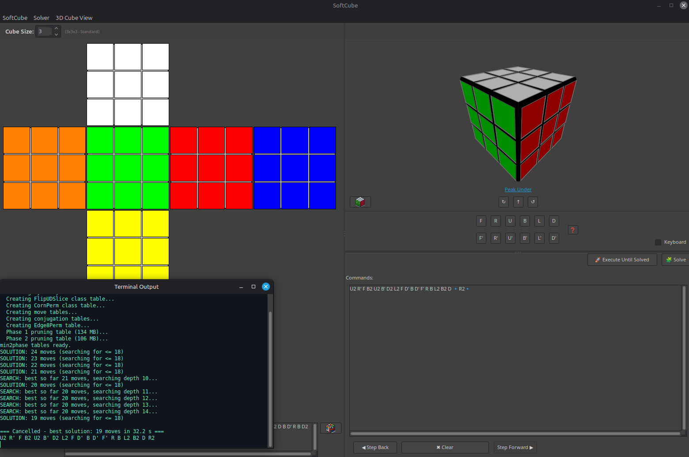
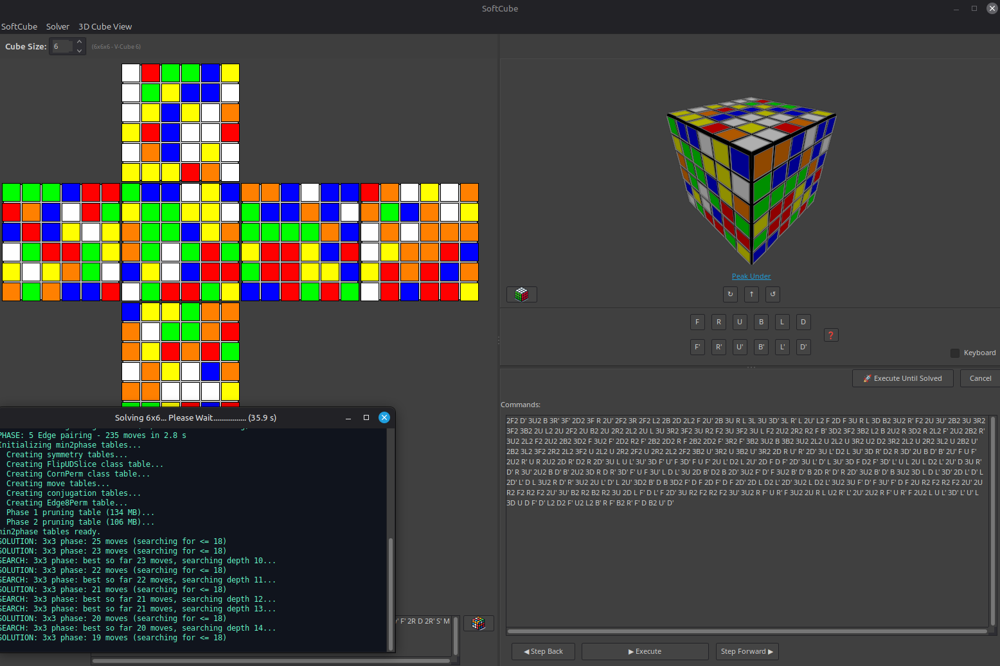
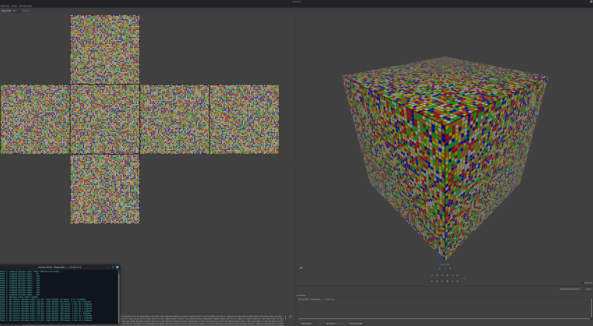

# SoftCube
Rubik's Cube simulator and solver written with Lazarus and Free Pascal. Supports any cube size from 2x2 and up with 3D visualization, keyboard controls, and webcam scanning.



## Features
- Interactive 3D cube with mouse and keyboard controls for any size (2x2 and up)
- Full solver for all cube sizes — solved a 50x50 in ~9 hours (2330 moves)
- Real-time solver progress in the terminal output window
- Manual color entry and webcam-based color scanning (up to 5x5)
- Solve quality presets (Fast / Balanced / Optimal)
- BGRABitmap-based rendering with lighting effects

### Solving a 6x6



### 50x50 scrambled



## Credits & Acknowledgments

### Herbert Kociemba
The NxN solver is based on [Herbert Kociemba's RubikNxNxNSolver](https://github.com/hkociemba/RubikNxNxNSolver) (Pascal/Lazarus). It uses a reduction-based approach that solves NxN cubes by reducing them to 3x3 and then applying the two-phase algorithm.

The built-in 3x3 two-phase solver is based on Kociemba's two-phase algorithm from [CubeExplorer](http://kociemba.org/cube.htm). His pioneering work on optimal and near-optimal Rubik's Cube solving algorithms is the foundation of the solver used here.

### Original 3D Rendering
The original 3D cube rendering code was obtained from [CodeS-SourceS.CommentCaMarche.net](https://codes-sources.commentcamarche.net/source/53132-rubik-s-cube) and has been substantially modified and extended to support NxN cubes.

## Building
Requires [Lazarus IDE](https://www.lazarus-ide.org/) with Free Pascal Compiler (FPC) and the BGRABitmap package.

```bash
lazbuild RubiksCube.lpi --build-all
```

The NxN solver CLI tool can be built separately:
```bash
cd nxn-solver
fpc nxn_solver.lpr
```
